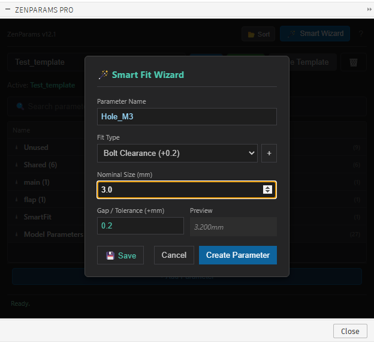
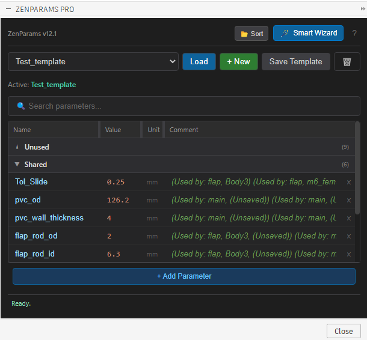

# 🧘 ZenParams Pro (v2.0)

### The "Right Way" to Parameterize in Fusion 360.

> **Speed:** Now 20x Faster with O(N) Crawling.
> **Persistence:** Saves directly to `.f3d` via Attributes (No JSON files).

> **"If you're hardcoding dimensions in your sketches, you're doing it wrong."** > _— Every Senior CAD Engineer ever._

---

## 🛑 Stop The Madness.

You know the drill. You design a beautiful enclosure. It's perfect. Then you buy the bolts and realize they're M3, not M2.5.
Now you have to hunt down **27 different sketches**, deep dive into **14 timeline features**, and manually change `2.5mm` to `3.0mm`.

**That is the path of pain.**

**ZenParams** is the path of enlightenment. It forces you to adopt the single most important habit in professional CAD: **Parametric Design.**

---

## 🔥 Why ZenParams?

### 1. 🧙‍♂️ Smart Fit Wizard (The "Killer" Feature)

Stop guessing tolerances.
"Is a loose fit 0.1mm or 0.2mm?"
"How much clearance does a 3D printed M3 hole need?"

**ZenParams knows.**

Select a context (Bolt, Magnet, Bearing, Insert), pick your nominal size, and **BOOM**. It calculates the perfect offset based on industry standards (and your own "User Presets").

### 2. ⚡ Live Synchronization

Fusion 360's native parameter window is... a modal dialog from 1995. It blocks your view. It blocks your clicks.

ZenParams lives in a **non-blocking palette**.

- Change a value? **Instant update.**
- Add a parameter? **Live sync.**
- No more clicking "OK" just to see if your design broke.

### 3. 💾 Project Templates (Presets)

Do you make enclosures? You probably use the same wall thickness (`2mm`), the same standoffs (`6mm`), and the same tolerance (`0.2mm`) every time.

Save your setup as a **Template**.
Start a new project -> Load "3D Print Box" -> **Done.**

### 4. 🧠 Auto-Categorization (The "Zen Mind")

**"But I have 500 parameters in my old design!"**

Don't panic. ZenParams features a **Reverse Dependency Crawler**.
It scans your entire design history to figure out _what_ your parameters are actually controlling.

- Used in the Lid? -> **Group: Lid**
- Used in the Mounting Holes? -> **Group: Mounts**
- Unused? -> **Group: Unused (Clean them up!)**

It works on **existing designs** instantly. No manual tagging required.

### 5. 🛡️ Dependency Protection

ZenParams is your safety net.
It **won't let you delete a parameter** that is currently holding your assembly together.

- Try to delete a used parameter? **Blocked.**
- Try to break your model? **Denied.**

### 6. 🎹 Excel-Style "Rapid Entry"

We built this for speed demons.

- **Narrow Mode**: Compact by default to save screen real estate.
- **Keyboard First**: Type `Name` -> `Tab` -> `Value` -> `Tab` -> `Comment`.
- **Enter (Once)**: Saves and locks the row.
- **Enter (Twice)**: Adds a new row instantly.

---

## 🚀 Features at a Glance

| Feature          | The Old Way                      | The Zen Way                          |
| :--------------- | :------------------------------- | :----------------------------------- |
| **Workflow**     | sketch -> `d` -> `3.2mm`         | click "M3 Bolt" -> Parameters Update |
| **Updates**      | Open menu -> Edit -> Enter -> OK | Edit value in panel -> Watch it move |
| **Organization** | "d1", "d2", "d3"... what is d2?  | Named groups. Clean comments.        |
| **Sanity**       | 10%                              | 100%                                 |

---

## 🛠️ Installation

1.  **Download** the code (Clone this repo).
2.  **Move** the `ZenParams` folder to your Fusion 360 Scripts folder:
    - **Windows**: `%appdata%\Autodesk\Autodesk Fusion 360\API\Scripts\`
    - **Mac**: `~/Library/Application Support/Autodesk/Autodesk Fusion 360/API/Scripts/`
3.  **Open Fusion 360**.
4.  Go to **Utilities** -> **Scripts and Add-Ins**.
5.  Find `ZenParams` under "My Scripts".
6.  Click **Run**. (Pro tip: Check "Run on Startup").
7.  **Right-click** "ZenParams" and set a **Keyboard Shortcut** (e.g., `Shift+P`) for instant access.

### ⌨️ Pro Tips (Keyboard First)

- **Instant Hide**: Press `ESC` to vanish the palette instantly.
- **Quick Edit**: Double-click any cell to edit. It behaves just like Excel.
- **Rapid Add**: press `Enter` twice to keep adding parameters without touching the mouse.

---

## 🧘 The Zen Philosophy

**ZenParams** isn't just a tool; it's a mentorship in a box. It gently nudges you away from "Direct Modeling Chaos" and towards "Parametric Bliss."

When you use ZenParams, you aren't just drawing lines. You are defining **Design Intent**.

> _Code is Poetry. CAD is Logic. Parameters are Truth._

---

## 📜 License

MIT. Go forth and parameterize.

---

## 🧪 Testing

ZenParams includes a comprehensive test suite to verify both logic and Fusion 360 integration.

### How to Run Tests

1.  Open Fusion 360.
2.  Go to **Scripts and Add-Ins**.
3.  Select **ZenParams** (the folder containing `test_suite.py`).
4.  Run the `test_suite.py` script (if visible) OR edit `ZenParams.manifest` to point to `test_suite.py` temporarily if you want to run it as the main script.
    - _Easier Method:_ The test suite is designed to be run as a script. If it doesn't appear, you can open it in the VS Code editor via Fusion and run it, or rename `test_suite.py` to `ZenParams_Tests.py` so Fusion sees it as a separate script if you move it to its own folder.
    - **Recommended:** We have provided `test_suite.py` in the root. To run it:
      1.  Open the "Text Commands" palette in Fusion.
      2.  Switch to "Py" (Python) mode.
      3.  Type: `import importlib.util; spec = importlib.util.spec_from_file_location("test_suite", r"C:\path\to\ZenParams\test_suite.py"); module = importlib.util.module_from_spec(spec); spec.loader.exec_module(module); module.run(None)`
      - _(Or just simply copy `test_suite.py` content and paste it into a new Script within Fusion if you interpret "running from IDE" difficult)._

### Test Scope

- **Pure Logic:** Verifies Preset saving/loading and Smart Fit data migration.
- **Fusion Integration:**
  - Creates a temporary "Clean Room" document.
  - Generates 3D geometry (Box).
  - Links parameters.
  - Verifies that the `DependencyCrawler` correctly identifies the relationship.
  - Closes the document automatically (no save).

> **Note:** Check `test_output/test_results.txt` for detailed logs after running.

## ⚡ Performance (v2.0)

We have completely rewritten the dependency engine.

- **Old:** $O(M \times N)$ Matrix Scan (Slow on large assemblies).
- **New:** $O(N)$ Forward-Indexing (Instant).
- **Benchmark:** 250 Parameters categorized in **0.05 seconds**.

## 💾 Native Persistence

ZenParams v2 no longer creates `presets.json` or `settings.json` in your scripts folder.
All data is stored securely inside your **Fusion 360 Design Attributes**.

- **Portable:** Send your `.f3d` to a friend, they get your ZenParams setup.
- **Clean:** No file clutter.

## 🌈 Adaptive UI

- **Auto-Fit:** Columns automatically resize to fit your longest parameter names.
- **Resizers:** Drag column borders to customize your view.
- **Horizontal Scroll:** No more clipped text on narrow screens.

---

## 🏗️ v2 Refactor (Architectural Overhaul)

We have recently migrated the core architecture from a simple script to a robust **Class-Based Add-in** structure.

### Key Changes

- **No More Zombie Processes**: `stop()` now explicitly unregisters all event handlers.
- **Improved Stability**: Startup/Shutdown is idempotent.
- **Automated Verification**: Use `ZenParams_TestRunner` to verify lifecycle stability.
