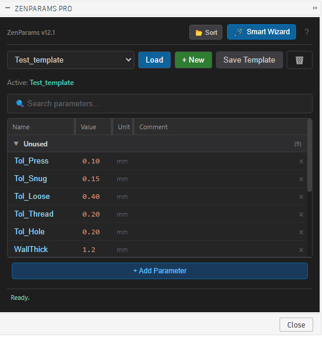
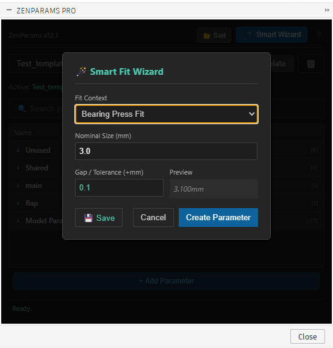

# ⚡ ZenParams PRO ⚡

### _THE "GOD MODE" PARAMETER MANAGER FOR FUSION 360_

> 🛑 **WARNING:** This plugin will make you physically incapable of tolerating the native Fusion 360 parameter window ever again. Side effects include extreme efficiency, methodical design habits, and a severe reduction in mouse clicks.

---

## 😤 THE IRONY (Why this exists)

**Fusion 360 is a masterpiece of modern engineering.** It can simulate stress loads on a rocket engine, generate toolpaths for 5-axis CNCs, and render photorealistic clouds.

**It is also stuck in 1999.**

Why, in the year 2025, are we typing `wall_thickness` into a modal window that looks like it was borrowed from Windows 98 SE? Why do we have to click a tiny `+` button 50 times just to define a box?

You are a creative mastermind, not a data entry temp. **ZenParams PRO** is here to save you from the tyranny of the "Modify Parameters" dialog.

## 🚀 THE SAVIOR (What it does)

**ZenParams PRO** is an **Always-On, High-Velocity Command Center** for your design intent.

- **It Lives on Screen:** Unlike the native modal, ZenParams is a palette. It stays open while you design. You never have to close it.
- **It Forces Methodical Design:** Because your parameters are instantly accessible and easy to group, you naturally stop using "Magic Numbers" (`10mm`) and start using "Engineering Variables" (`Top_Plate_Thick`).
- **It Saves Your Sanity:** We timed it. ZenParams cuts the time to create, name, and value a parameter by **70%**.

---

## 🔬 ANALYTICAL FEATURE BREAKDOWN

We re-engineered the entire workflow to focus on **Speed**, **Context**, and **Density**.

### 1. 📉 Smart Compact Layout (The "Density Engine")

We realized that screen real estate is precious.

- **Shrink-Wrap Columns**: The Name and Value columns use a custom algorithm to shrink to the _exact_ width of their text. A value of `0.1` takes up 15 pixels. `125.0` takes up 40. No dead space.
- **Greedy Comment Engine**: The Comment column is programmed to aggressively consume 100% of the remaining space, ensuring your actual data stays tight and readable on the left.
- **Result**: You can see 30+ parameters at a glance without scrolling.

### 2. ⚡ High-Velocity Data Flow

- **Ctrl + Enter (Global)**: Press this from _anywhere_ to add a row. You don't even need to touch the mouse.
- **Excel-Style Locking**: Type a value, press **Enter**. It saves instantly and **Locks** the field. No accidental overwrites.
- **Live Sync**: Changed a dimension in the canvas? ZenParams updates instantly. It’s always watching.

### 3. 🧭 The "Zen Crawler" (Auto-Context)

Fusion 360 doesn't know _what_ your parameters do. **ZenParams does.**
It crawls your design's timeline, analyzing sketches, features, and faces to map every parameter to its owner.

- **[Body Name]**: Usage is detected automatically. `UserParam` -> `ModelParam` -> `Sketch` -> `Extrude` -> `Body`.
- **[Shared]**: Detected usage across multiple bodies? It gets tagged as Shared.
- **[Unused]**: Parameters driving nothing are visually grayed out. Time to clean house.

### 4. 🪄 The Smart Fit Wizard

Stop doing mental math for 3D printing tolerances.

- **Click The Wand**: Choose a context (e.g., "Heat Set Insert", "Magnet Press Fit").
- **We Do The Math**: ZenParams calculates the perfect interference/clearance (e.g., `Hole_Dia = 3.8mm` for an M3 insert) based on empirical standards.

### 5. 🛡️ Safety Systems

- **Dependency Guard**: Try to delete a parameter that's driving a feature. **DENIED.** ZenParams tells you exactly what would break, preventing the dreaded "Red Timeline of Death".
- **Preset Cloning**: Save your "PLA Tolerance Standards" or "CNC Aluminum Specs" as a preset. Load them into any new design with one click.

---

## 📦 INSTALLATION (30 Seconds)

1.  **Download** this repository.
2.  **Move** the folder to your Fusion 360 Scripts folder:
    - _Windows_: `%appdata%\Autodesk\Autodesk Fusion 360\API\Scripts\`
    - _Mac_: `~/Library/Application Support/Autodesk/Autodesk Fusion 360/API/Scripts/`
3.  **Open Fusion 360** -> **Utilities** -> **Scripts and Add-Ins**.
4.  Find **ZenParams** and click **RUN**.

> **PRO TIP:** Check "Run on Startup". You will never want to design without this again.

---

## 🎮 SHORTCUT CHEAT SHEET

| Shortcut         | Action                             |
| :--------------- | :--------------------------------- |
| **Ctrl + Enter** | **Add Parameter** (Works globally) |
| **Enter**        | **Save & Lock** current field      |
| **Double Click** | **Edit** a locked field            |
| **Esc**          | Cancel edit / Hide Palette         |

---

### 💬 FEEDBACK & LICENSE

Built for **Engineers who value their time**.
**MIT License**. Free forever.

_"Design like a pro. Parameterize like a Zen Master."_
